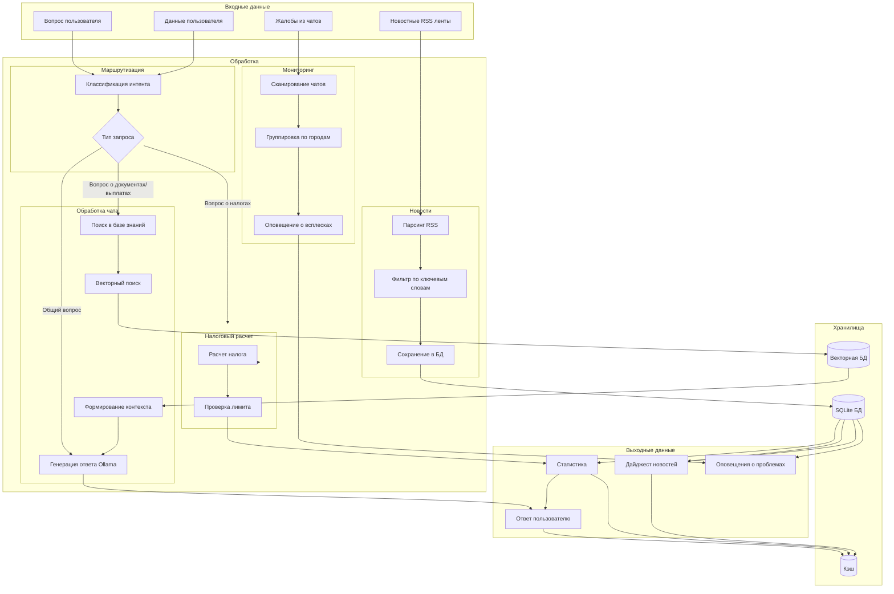
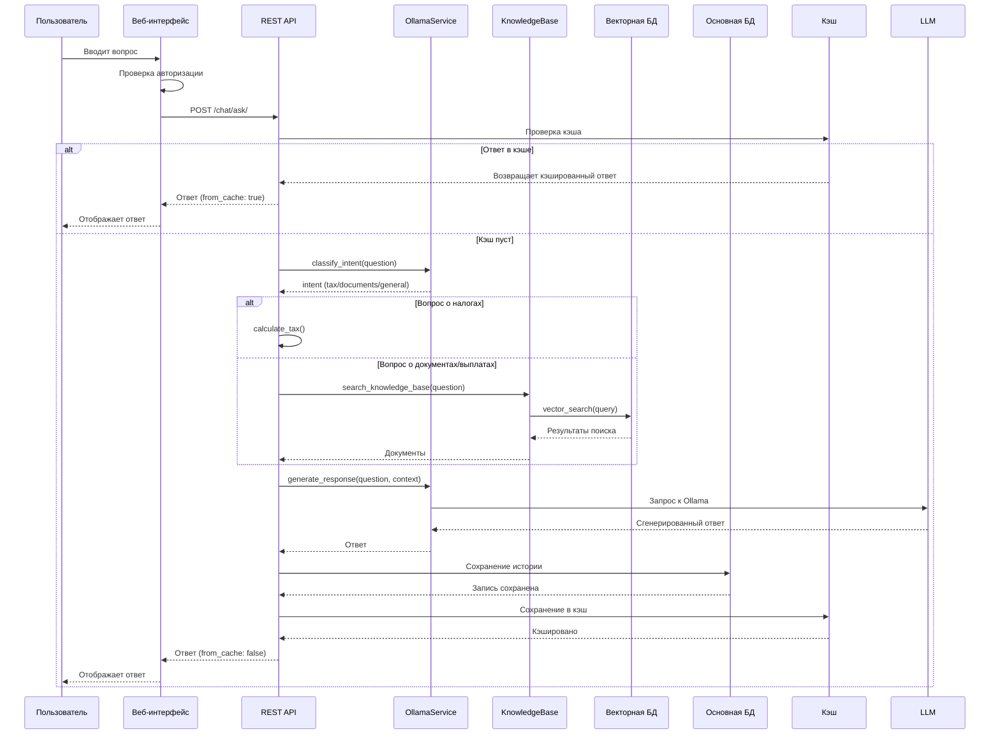
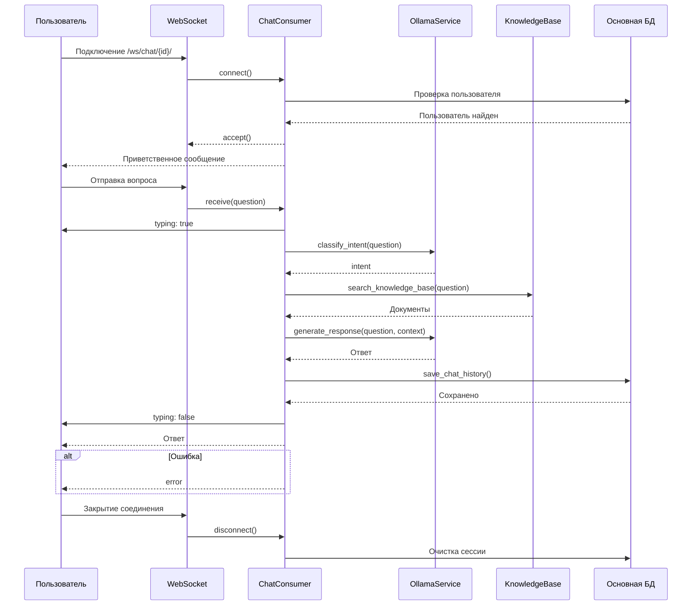
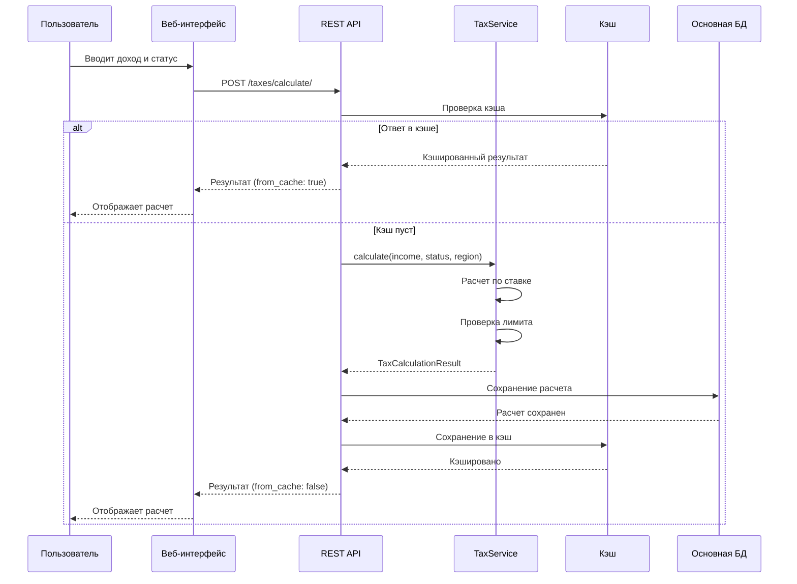
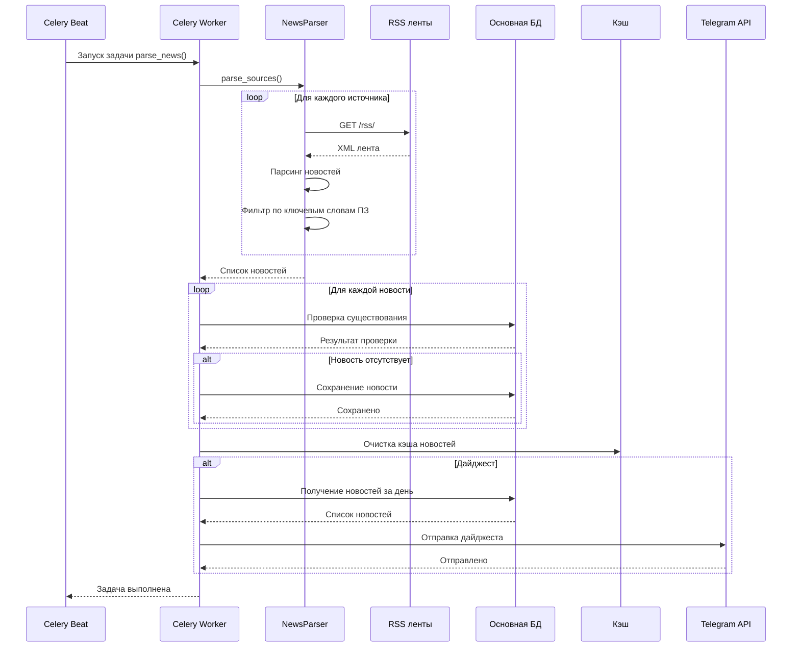
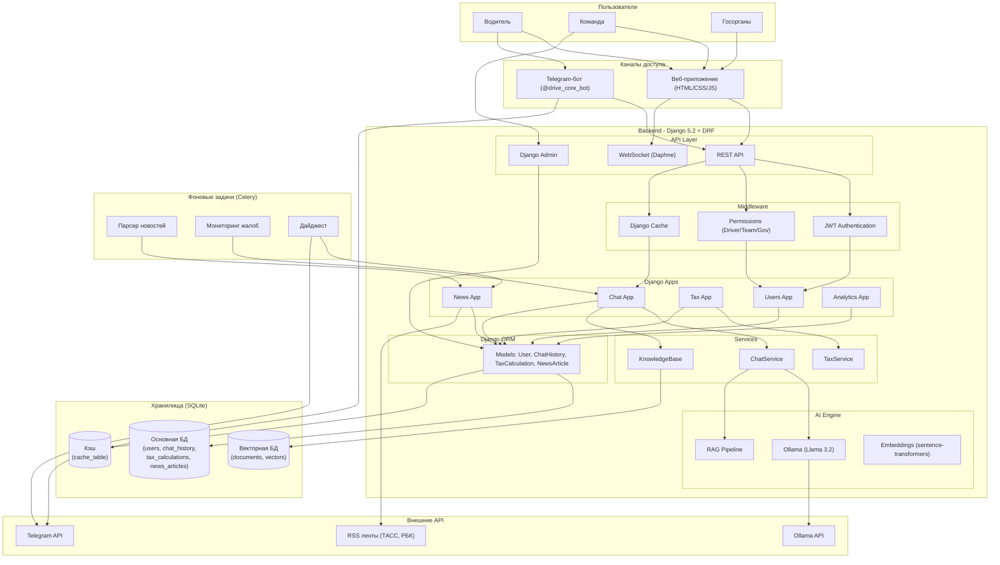
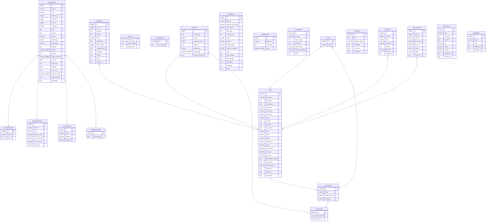

# DriveCore — ИИ-ассистент для платформенной занятости

[](https://www.djangoproject.com/)
[](https://www.django-rest-framework.org/)
[](https://ollama.ai/)
[](https://www.docker.com/)
[](LICENSE)

## О проекте

**DriveCore** — это интеллектуальный ИИ-ассистент для водителей такси и курьеров, работающих на платформах занятости (Яндекс Про, Uber, Bolt и др.). Проект помогает водителям разбираться с налогами, документами, выплатами и правилами работы.

### Цели проекта

- Создание ИИ-ассистента для водителей платформенной занятости
- Реализация RAG (Retrieval-Augmented Generation) для точных ответов на основе базы знаний
- Интеграция с Telegram для доступности на мобильных устройствах
- Мониторинг проблем и оповещение о всплесках жалоб
- Автоматический парсинг новостей по теме платформенной занятости

---

## Основные возможности

### Для водителей

| Функция | Описание |
|---------|----------|
| **Чат с ИИ** | Задавайте вопросы о налогах, документах, выплатах на русском языке |
| **Понимание смысла** | Векторный поиск понимает разные формулировки одного вопроса |
| **Налоговый калькулятор** | Рассчитайте налоги для самозанятого, ИП или наёмного работника |
| **WebSocket чат** | Общение в реальном времени без перезагрузки страницы |
| **Telegram бот** | Доступ к ассистенту через Telegram (@drive_core_bot) |

### Для команды

| Функция | Описание |
|---------|----------|
| **Дашборд** | Отслеживание доходов, налогов и активности пользователей |
| **Мониторинг проблем** | Автоматическое обнаружение всплесков жалоб по городам |
| **Новости ПЗ** | Ежедневный дайджест новостей платформенной занятости |
| **Django Admin** | Управление пользователями, чатами, налоговыми расчётами |

### Интеграции

| Сервис | Назначение |
|--------|------------|
| **Ollama** | Локальная LLM (Llama 3.2) для генерации ответов |
| **Telegram Bot** | Доступ к ассистенту через мессенджер |
| **RSS ленты** | Автоматический парсинг новостей (ТАСС, РБК) |
| **Sentence-Transformers** | Векторные эмбеддинги для семантического поиска |

---


## Логика работы ИИ-агента

### Входные и выходные данные

| Тип данных | Источник | Формат | Назначение |
|------------|----------|--------|------------|
| **Вопрос пользователя** | Веб-форма / Telegram | Текст | Запрос к ИИ-ассистенту |
| **Данные пользователя** | База данных Django | JSON | Контекст (статус, доход, регион) |
| **Новостные RSS ленты** | ТАСС, РБК | XML/RSS | Источник новостей по ПЗ |
| **Жалобы из чатов** | История чатов | Текст | Мониторинг проблем |

### Инструменты и ИИ-сервисы

| Сервис | Назначение |
|--------|------------|
| **Ollama (Llama 3.2)** | Генерация ответов на естественном языке |
| **Sentence-Transformers** | Векторные эмбеддинги для семантического поиска |
| **RAG Pipeline** | Поиск релевантных документов в базе знаний |
| **Celery** | Фоновые задачи (парсинг новостей, мониторинг) |
| **Django Channels** | WebSocket для реального времени |

### Польза для команды

| Польза | Описание |
|--------|----------|
| **Снижение нагрузки на поддержку** | Автоматические ответы на частые вопросы |
| **Ускорение работы** | Мгновенный доступ к информации через чат |
| **Мониторинг проблем** | Раннее обнаружение всплесков жалоб |
| **Аналитика** | Дашборд с ключевыми метриками |
| **Автоматизация** | Парсинг новостей и ежедневные дайджесты |


---

## Автоматические задачи

### Парсер новостей по платформенной занятости

Система автоматически парсит новости из RSS-лент (ТАСС, РБК) и отбирает материалы по теме платформенной занятости.

**Как это работает:**

1. Каждый день в 9:00 Celery запускает задачу `parse_news`
2. Система парсит RSS-ленты ТАСС и РБК
3. Из всех новостей отбираются только те, которые содержат ключевые слова:
   - `такси`, `самозанятый`, `ИП`, `платформенная занятость`, `гиг-экономика`
   - `водитель`, `курьер`, `яндекс такси`, `uber`, `bolt`, `grab`
4. Отобранные новости сохраняются в базу данных с категорией `platform_employment`
5. В 9:05 формируется дайджест и отправляется в Telegram-чат команды

**Пример дайджеста:**
```
Ежедневный дайджест 06.07.2026

Новости (1):
• ТАСС: украинские ТЦК вербуют таксистов
  https://tass.ru/armiya-i-opk/27891063
```

### Мониторинг проблем

Система анализирует жалобы водителей из чатов и оповещает команду о всплесках проблем.

**Как это работает:**

1. Каждые 2 часа Celery запускает задачу `monitor_problems`
2. Система сканирует историю чатов за последние 2 часа
3. Поиск жалоб по ключевым словам:
   - `проблема`, `ошибка`, `не работает`, `сбой`, `баг`
   - `жалоба`, `недоволен`, `плохо`, `ужасно`
   - `деньги`, `выплата`, `не получил`, `задержка`
4. Жалобы группируются по городам
5. Если в одном городе зафиксировано 3+ жалоб - отправляется оповещение

---

## Диаграмма потоков данных



---

## Диаграммs последовательностей проекта DriveCore

### Диаграмма последовательности для чат-бота



### Диаграмма последовательности для WebSocket чата



### Диаграмма последовательности налогового калькулятора



### Диаграмма последовательности для новостей



---

## Технологический стек

### Backend

| Технология | Версия | Назначение |
|------------|--------|------------|
| **Python** | 3.11 | Язык программирования |
| **Django** | 5.2.15 | Веб-фреймворк |
| **Django REST Framework** | 3.17.1 | REST API |
| **SQLite** | - | База данных |
| **Daphne** | 4.1.0 | ASGI сервер для WebSocket |
| **Channels** | 4.0.0 | WebSocket поддержка |
| **Celery** | 5.6.3 | Фоновые задачи |
| **JWT** | - | Аутентификация |

### AI и векторный поиск

| Технология | Назначение |
|------------|------------|
| **Ollama** | Локальная LLM (Llama 3.2) |
| **Sentence-Transformers** | Генерация векторных эмбеддингов |
| **RAG** | Retrieval-Augmented Generation |
| **Semantic Search** | Поиск по смыслу (векторный) |

### Frontend

| Технология | Назначение |
|------------|------------|
| **HTML5/CSS3** | Разметка и стилизация |
| **JavaScript (ES6+)** | Интерактивность и WebSocket |
| **Chart.js** | Графики на дашборде |

### Инструменты

| Инструмент | Назначение |
|------------|------------|
| **Docker** | Контейнеризация |
| **Docker Compose** | Оркестрация сервисов |
| **pytest** | Тестирование |
| **coverage.py** | Анализ покрытия кода |

---

## Архитектура проекта

### Диаграмма архитектуры



### Структура проекта

```
drivecore-django/
├── analytics/                         # Приложение аналитики и дашбордов
├── celery/                            # Конфигурация Celery
├── chat/                              # Приложение чата с ИИ
├── config/                            # Настройки проекта
├── core/                              # Ядро системы (AI, векторный поиск)
├── db.sqlite3                         # Основная база данных
├── docker-compose.yml                 # Docker Compose
├── Dockerfile                         # Docker образ
├── docs/                              # Документация
├── entrypoint.sh                      # Точка входа для Docker
├── frontend/                          # Фронтенд (HTML, CSS, JS)
├── htmlcov/                           # Отчёты о покрытии тестами
├── knowledge_base/                    # База знаний (документы)
├── logs/                              # Логи
├── manage.py                          # Управляющий скрипт Django
├── media/                             # Загруженные файлы
├── news/                              # Приложение новостей
├── ollama_data/                       # Данные Ollama (модели)
├── pytest.ini                         # Настройка pytest
├── README.md                          # Документация проекта
├── requirements.txt                   # Зависимости проекта
├── scripts/                           # Вспомогательные скрипты
├── staticfiles/                       # Собранная статика
├── taxes/                             # Приложение налогового калькулятора
├── telegram_bot/                      # Telegram бот
├── tests/                             # Тесты
├── users/                             # Приложение пользователей
├── vector_db.sqlite3                  # Векторная база данных
└── venv/                              # Виртуальное окружение
```

---

# Схема базы данных (ER-диаграмма)



## Описание таблиц

### Основные таблицы приложения

#### 1. `User` — Пользователи
Хранит информацию о всех пользователях системы: водителях, сотрудниках команды и представителях госорганов.

| Поле | Тип | Описание |
|------|-----|----------|
| `id` | integer PK | Уникальный идентификатор |
| `username` | varchar | Логин пользователя |
| `password` | varchar | Хеш пароля |
| `email` | varchar | Email пользователя |
| `role` | varchar | Роль: `driver` (водитель), `team` (команда), `gov` (госорганы) |
| `status` | varchar | Статус: `self_employed` (самозанятый), `ie` (ИП), `employee` (наёмный) |
| `region` | varchar | Регион работы |
| `telegram_id` | varchar | ID в Telegram для связи с ботом |
| `total_income` | decimal | Общий доход |
| `tax_paid` | decimal | Уплачено налогов |
| `tax_rate` | decimal | Текущая налоговая ставка |
| `documents_verified` | bool | Проверены ли документы |

#### 2. `ChatHistory` — История чатов
Хранит все диалоги пользователей с ИИ-ассистентом.

| Поле | Тип | Описание |
|------|-----|----------|
| `id` | integer PK | Уникальный идентификатор |
| `user_id` | integer FK | Ссылка на пользователя |
| `question` | text | Вопрос пользователя |
| `answer` | text | Ответ ИИ-ассистента |
| `intent` | varchar | Классификация вопроса: `tax`, `documents`, `payments`, `general` |
| `confidence` | real | Уверенность классификации (0-1) |
| `tokens_used` | integer | Количество токенов, использованных для генерации |
| `response_time` | real | Время генерации ответа (в секундах) |
| `is_helpful` | bool | Полезен ли ответ для пользователя |
| `context` | text (JSON) | Контекст пользователя на момент вопроса (статус, регион, доход) |

#### 3. `TaxCalculation` — Налоговые расчёты
Хранит историю налоговых расчётов для каждого пользователя.

| Поле | Тип | Описание |
|------|-----|----------|
| `id` | integer PK | Уникальный идентификатор |
| `user_id` | integer FK | Ссылка на пользователя |
| `income` | decimal | Доход для расчёта |
| `tax_amount` | decimal | Рассчитанная сумма налога |
| `tax_rate` | decimal | Применённая налоговая ставка |
| `status` | varchar | Статус пользователя на момент расчёта |
| `region` | varchar | Регион пользователя |

#### 4. `NewsArticle` — Новости
Хранит новости, собранные из RSS-лент.

| Поле | Тип | Описание |
|------|-----|----------|
| `id` | integer PK | Уникальный идентификатор |
| `title` | varchar | Заголовок новости |
| `summary` | text | Краткое содержание |
| `full_text` | text | Полный текст новости |
| `url` | varchar | Ссылка на источник |
| `source` | varchar | Источник новости (ТАСС, РБК) |
| `category` | varchar | Категория: `platform_employment` (ПЗ), `general` (общие) |
| `published_at` | text | Дата публикации |

#### 5. `Document` — Документы
Хранит сгенерированные документы (отчёты, справки).

| Поле | Тип | Описание |
|------|-----|----------|
| `id` | integer PK | Уникальный идентификатор |
| `user_id` | integer FK | Ссылка на пользователя |
| `title` | varchar | Название документа |
| `doc_type` | varchar | Тип: `report`, `certificate`, `contract`, `invoice` |
| `content` | text (JSON) | Содержание документа |
| `file_path` | varchar | Путь к файлу на диске |

---

### Системные таблицы Django

#### 6. `LogEntry` — Логи действий
Журнал действий в админ-панели Django.

#### 7. `Group` — Группы пользователей
Группы для управления правами доступа.

#### 8. `Permission` — Разрешения
Права доступа для пользователей и групп.

#### 9. `ContentType` — Типы контента
Метаданные о моделях Django (используется для разрешений).

#### 10. `Session` — Сессии
Хранит активные сессии пользователей.

---

### Таблицы Celery (фоновые задачи)

#### 11. `PeriodicTask` — Периодические задачи
Настройки периодических задач для Celery Beat.

#### 12. `IntervalSchedule` — Интервалы
Расписания для периодических задач (каждые N минут/часов/дней).

#### 13. `CrontabSchedule` — Cron-расписания
Расписания в формате cron.

#### 14. `TaskResult` — Результаты задач
Результаты выполнения фоновых задач.

#### 15. `GroupResult` — Результаты групп задач
Результаты выполнения групп задач.

---

## Связи между таблицами

```
User → ChatHistory: Один пользователь может иметь много чатов (1:N)
User → TaxCalculation: Один пользователь может иметь много налоговых расчётов (1:N)
User → Document: Один пользователь может иметь много документов (1:N)
User ↔ Group: Пользователи могут состоять в нескольких группах (N:N)
User ↔ Permission: Пользователи могут иметь несколько разрешений (N:N)
Group ↔ Permission: Группы могут иметь несколько разрешений (N:N)
```

---

## Дополнительные таблицы (модули)

### `IntentLog` — Логи классификации интентов
Используется для анализа точности классификации вопросов.

### `Dashboard` — Дашборды
Хранит настройки и данные для дашбордов.

---

## Запуск проекта

### Предварительные требования

- Python 3.11 или выше
- Docker Desktop (для Docker-запуска)
- 4 ГБ свободной оперативной памяти
- Порт 8000 свободен

### Вариант 1: Локальный запуск

#### Шаг 1: Клонирование репозитория

```bash
git clone https://github.com/yourusername/drivecore-django.git
cd drivecore-django
```

#### Шаг 2: Создание виртуального окружения

```bash
python -m venv venv
source venv/bin/activate  # Windows: venv\Scripts\activate
```

#### Шаг 3: Установка зависимостей

```bash
pip install -r requirements.txt
```

#### Шаг 4: Создание переменных окружения

Создайте файл `.env` в корне проекта:

```env
SECRET_KEY=django-insecure-key-for-dev
DEBUG=True
OLLAMA_HOST=http://localhost:11434
OLLAMA_MODEL=llama3.2:3b
TELEGRAM_BOT_TOKEN=ваш_токен_бота
```

#### Шаг 5: Установка и запуск Ollama

```bash
# Установка Ollama
curl -fsSL https://ollama.ai/install.sh | sh

# Запуск Ollama
ollama serve

# Скачать модель
ollama pull llama3.2:3b
```

#### Шаг 6: Настройка базы данных

```bash
# Применение миграций
python manage.py migrate

# Создание суперпользователя
python manage.py createsuperuser

# Обновление базы знаний
python scripts/update_knowledge_base.py

# Индексация векторов
python scripts/index_knowledge_base.py
```

#### Шаг 7: Запуск проекта

```bash
# Запуск Daphne (WebSocket + HTTP)
daphne -b 0.0.0.0 -p 8000 config.asgi:application
```

#### Шаг 8: Запуск Celery (фоновые задачи)

```bash
# В отдельном терминале
celery -A config worker --loglevel=info
```

#### Шаг 9: Запуск Telegram бота (опционально)

```bash
# В отдельном терминале
python telegram_bot/bot.py
```

### Вариант 2: Запуск через Docker

#### Шаг 1: Клонирование репозитория

```bash
git clone https://github.com/yourusername/drivecore-django.git
cd drivecore-django
```

#### Шаг 2: Создание переменных окружения

Создайте файл `.env`:

```env
SECRET_KEY=django-insecure-key-for-docker
DEBUG=False
OLLAMA_HOST=http://ollama:11434
OLLAMA_MODEL=llama3.2:3b
TELEGRAM_BOT_TOKEN=ваш_токен_бота
ALLOWED_HOSTS=localhost,127.0.0.1,0.0.0.0
```

#### Шаг 3: Сборка и запуск

```bash
# Сборка образов
docker-compose build

# Запуск всех сервисов
docker-compose up -d

# Запуск с Telegram ботом
docker-compose --profile telegram up -d
```

#### Шаг 4: Доступ к приложению

| URL | Назначение |
|-----|------------|
| http://localhost:8000/ | Главная страница |
| http://localhost:8000/admin/ | Панель администратора |
| http://localhost:8000/swagger/ | API документация |  

#### Шаг 5: Управление Docker

```bash
# Просмотр статуса
docker-compose ps

# Просмотр логов
docker-compose logs -f web

# Остановка
docker-compose down

# Остановка с удалением томов
docker-compose down -v
```

---

## Тестирование

### Запуск тестов

```bash
# Запуск всех тестов с покрытием
python -m pytest tests/ -v --cov=. --cov-report=term

# Запуск конкретного файла
python -m pytest tests/test_models.py -v

# Отчёт о покрытии в HTML
python -m pytest tests/ --cov=. --cov-report=html
```

### Покрытие тестами

| Компонент | Покрытие |
|-----------|----------|
| Модели (models) | ~90% |
| Сериализаторы (serializers) | ~75% |
| Сервисы (services) | ~85% |
| API Views | ~70% |
| Celery задачи (tasks) | ~70% |
| Утилиты (utils/decorators) | ~50% |
| **Общее покрытие** | **~70%** |

---

## API Документация

После запуска доступна Swagger документация:

- http://localhost:8000/swagger/

### Основные эндпоинты

| Метод | URL | Назначение |
|-------|-----|------------|
| POST | `/api/v1/auth/login/` | Вход в систему |
| POST | `/api/v1/auth/refresh/` | Обновление JWT |
| POST | `/api/v1/chat/ask/` | Задать вопрос ИИ |
| GET | `/api/v1/chat/` | История чатов |
| POST | `/api/v1/taxes/calculate/` | Расчёт налогов |
| GET | `/api/v1/taxes/rates/` | Налоговые ставки |
| GET | `/api/v1/analytics/stats/` | Статистика |
| GET | `/api/v1/analytics/problems/` | Мониторинг проблем |
| GET | `/api/v1/news/latest/` | Последние новости |
| GET | `/api/v1/users/me/` | Текущий пользователь |

### WebSocket

| URL | Назначение |
|-----|------------|
| `ws://localhost:8000/ws/chat/{user_id}/` | Чат в реальном времени |

---

## Telegram Бот

### Ссылка на бота

[@drive_core_bot](https://t.me/drive_core_bot)

### Команды

| Команда | Описание |
|---------|----------|
| `/start` | Начать работу (регистрация) |
| `/help` | Помощь |
| `/status` | Статус пользователя |
| `/tax` | Налоговый калькулятор |

### Пример диалога

```
Пользователь: /start
Бот: Привет! Выберите свою роль...

Пользователь: Я водитель
Бот: Роль выбрана. Теперь укажи свой статус...

Пользователь: Самозанятый
Бот: Статус сохранён! Задайте вопрос...

Пользователь: Сколько налогов платит самозанятый?
Бот: Самозанятые платят 4% с физлиц и 6% с юрлиц...
```

---

## Лицензия

MIT License